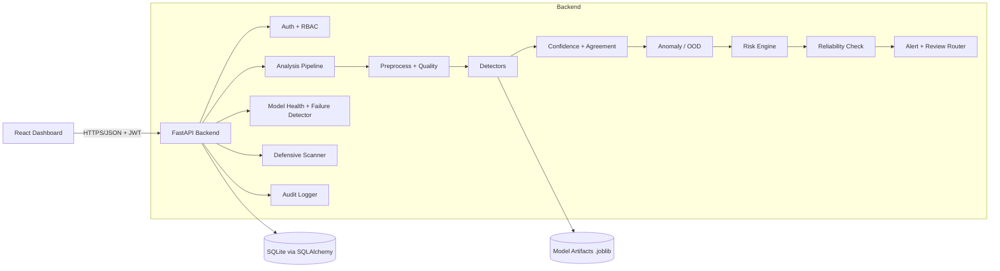

# AI FraudShield — Software Requirements Specification (SRS)

**Standard reference:** Structured after IEEE 830 / ISO/IEC/IEEE 29148 (simplified for an academic MVP)
**Product:** AI FraudShield — AI Fraud Detection, Model Security & Failure Detection System
**Version:** 1.0
**Date:** 24 September 2026
**Companion document:** PRD.md

---

## Table of Contents

1. Introduction
2. Overall Description
3. System Architecture Overview
4. Functional Requirements
5. External Interface Requirements
6. API Specification
7. Database Requirements
8. ML Requirements
9. Risk Engine Specification
10. Model Health & Failure Detection Specification
11. Security Requirements
12. Non-Functional Requirements
13. Testing Requirements
14. Traceability Matrix
15. Appendices

---

## 1. Introduction

### 1.1 Purpose
This SRS defines the functional and non-functional requirements of **AI FraudShield**, a prototype that (a) detects suspicious/fraudulent inputs and (b) monitors the reliability of the AI models that make those detections.

### 1.2 Scope
The system provides a FastAPI backend, SQLite database, scikit-learn ML components, a rule-based and statistical monitoring layer, and a React dashboard. It is a **4–5 hour academic prototype**, not a production system.

### 1.3 Definitions and Acronyms

| Term | Meaning |
|------|---------|
| FP / FN | False Positive / False Negative |
| FPR / FNR | False Positive Rate / False Negative Rate |
| OOD | Out-of-Distribution (input unlike training data) |
| PSI | Population Stability Index (drift measure) |
| KS test | Kolmogorov–Smirnov test (distribution comparison) |
| RBAC | Role-Based Access Control |
| JWT | JSON Web Token |
| ANN | Artificial Neural Network |
| TF-IDF | Term Frequency – Inverse Document Frequency |
| MVP | Minimum Viable Product |

### 1.4 Implementation Label Convention
Every detector/module carries exactly one label, stored in the database and shown in the UI:

| Label | Meaning |
|-------|---------|
| `REAL_ML` | Trained ML model on data |
| `RULE_BASED` | Deterministic heuristics/rules |
| `STATISTICAL` | Statistical test/metric (not a trained model) |
| `MOCK` | Simulated/demo detector — **not production-grade** |
| `FUTURE` | Not implemented in MVP |

### 1.5 References
- Scikit-learn documentation (LogisticRegression, IsolationForest, RandomForest, MLPClassifier, KNN, KMeans)
- FastAPI documentation
- OWASP API Security Top 10
- Population Stability Index literature (credit-risk model monitoring)
- IEEE Std 830-1998 / ISO/IEC/IEEE 29148

---

## 2. Overall Description

### 2.1 Product Perspective
A standalone web application: React SPA ⇄ FastAPI REST API ⇄ SQLite + serialized model artifacts (`.joblib`).

### 2.2 Product Functions (high level)
1. Authenticate users and enforce roles.
2. Accept and validate case inputs.
3. Preprocess and quality-check inputs.
4. Run specialised detectors.
5. Compute confidence, agreement, and OOD/anomaly scores.
6. Aggregate into a 0–100 risk score with explanation.
7. Evaluate model reliability per case and globally.
8. Raise alerts and route to human review.
9. Record audit logs and provide dashboard/report views.

### 2.3 User Classes

| Class | Permissions |
|-------|-------------|
| `admin` | Everything: users, config, evaluation, scanner, health, all cases |
| `analyst` | Analyze cases, view results, human review, view health |
| `auditor` | Read-only: cases, alerts, audit logs, health |

### 2.4 Operating Environment
- Python 3.10+, FastAPI, Uvicorn, SQLAlchemy, SQLite
- scikit-learn, pandas, numpy, scipy, opencv-python (light use), joblib
- Node.js 18+, React, Plotly (`react-plotly.js`)
- Windows/Linux/macOS laptop; no GPU

### 2.5 Design Constraints
- 4–5 hour build window; single developer.
- Scikit-learn baseline models first; PyTorch/TensorFlow only if time remains (FUTURE).
- Synthetic/public/legally permitted data only.
- Defensive purpose only.

### 2.6 Assumptions and Dependencies
- Ground truth for health metrics comes from a labelled synthetic set and human-review labels.
- Default thresholds are **placeholders** and require validation on representative data.
- Mock modules produce simulated output from provided synthetic feature values.

---

## 3. System Architecture Overview

**Pipeline order (must be preserved):**
Input → Preprocessing → Input Validation/Quality → Specialised Detection → Confidence Analysis → Cross-Model Verification → Anomaly/OOD Detection → Risk Aggregation → Model Failure Detection → Human Review → Alert + Explanation + Report.

---

## 4. Functional Requirements

Priority: **P0** = must, **P1** = should, **P2** = could. Label shows implementation type.

### 4.1 Authentication & Authorization (FR-AUTH)

| ID | Requirement | Pri |
|----|-------------|-----|
| FR-AUTH-1 | The system shall allow users to log in with username and password and receive a signed JWT access token. | P0 |
| FR-AUTH-2 | Passwords shall be stored only as salted hashes (bcrypt/passlib). | P0 |
| FR-AUTH-3 | Tokens shall expire (default 60 minutes, configurable). | P0 |
| FR-AUTH-4 | The system shall enforce RBAC on every protected endpoint according to §2.3. | P0 |
| FR-AUTH-5 | An admin shall be able to create users and assign roles. | P1 |
| FR-AUTH-6 | Repeated failed logins from one client shall be rate-limited. | P1 |
| FR-AUTH-7 | A seed admin user shall be created on first run from environment variables (no hard-coded password in repo). | P0 |

### 4.2 Case Intake & Validation (FR-IN)

| ID | Requirement | Pri |
|----|-------------|-----|
| FR-IN-1 | The system shall accept a case with any combination of: `text`, `url`, `transaction` (structured fields), `identity` (structured fields), and `media_features` (synthetic simulated features for voice/face/document). | P0 |
| FR-IN-2 | The system shall reject a case with no analysable content (HTTP 422). | P0 |
| FR-IN-3 | The system shall validate types, ranges, and lengths (e.g., text ≤ 5,000 chars; amount ≥ 0). | P0 |
| FR-IN-4 | The system shall sanitise text (trim, normalise whitespace, strip control characters). | P0 |
| FR-IN-5 | The system shall compute an **input quality score** (0–1) and flag low-quality input (empty fields, too-short text, missing features). | P0 |
| FR-IN-6 | If input quality is below threshold, the result shall carry a `low_input_quality` flag that reduces reliability. | P0 |
| FR-IN-7 | Every accepted input shall be persisted with a hash (SHA-256) and timestamp. | P0 |
| FR-IN-8 | File upload (optional) shall accept only allow-listed types and sizes and be treated as **metadata-only** in the MVP. | P2 |

### 4.3 Preprocessing (FR-PRE)

| ID | Requirement | Pri |
|----|-------------|-----|
| FR-PRE-1 | Text shall be lower-cased and cleaned before TF-IDF vectorization (same vectorizer as training). | P0 |
| FR-PRE-2 | Tabular features shall be scaled with the `StandardScaler` fitted at training time. | P0 |
| FR-PRE-3 | Missing tabular values shall be imputed with training medians; the count of imputed fields shall be recorded. | P0 |
| FR-PRE-4 | URL lexical features shall be extracted deterministically (length, digit ratio, IP-host flag, `@`, hyphens, subdomain count, suspicious keywords, TLD risk). | P1 |

### 4.4 Text / Phishing Detector (FR-TXT) — `REAL_ML`

| ID | Requirement | Pri |
|----|-------------|-----|
| FR-TXT-1 | The system shall classify text as `phishing_suspicious` or `benign` using TF-IDF + Logistic Regression (primary). | P0 |
| FR-TXT-2 | The system shall also compute a second opinion using TF-IDF + Linear SVM (calibrated) or Naive Bayes (secondary). | P0 |
| FR-TXT-3 | The system shall output probability, predicted label, and top contributing terms (from LR coefficients). | P0 |
| FR-TXT-4 | The system shall compute model agreement between primary and secondary (label match and probability gap). | P0 |
| FR-TXT-5 | The system shall store both predictions in `model_predictions`. | P0 |

### 4.5 Tabular Fraud Detector (FR-TAB) — `REAL_ML`

| ID | Requirement | Pri |
|----|-------------|-----|
| FR-TAB-1 | The system shall classify a transaction/behaviour record as fraud/non-fraud using Random Forest (primary). | P0 |
| FR-TAB-2 | The system shall also compute an ANN prediction using `MLPClassifier` (secondary). | P0 |
| FR-TAB-3 | The system shall output probability, label, and top feature importances. | P0 |
| FR-TAB-4 | The system shall compute RF–ANN disagreement. | P0 |
| FR-TAB-5 | Suggested features: `amount`, `hour_of_day`, `txn_count_24h`, `avg_amount_30d`, `amount_to_avg_ratio`, `new_device`, `geo_distance_km`, `account_age_days`, `failed_logins_24h`. | P0 |

### 4.6 Anomaly & OOD Detection (FR-ANO) — `REAL_ML`

| ID | Requirement | Pri |
|----|-------------|-----|
| FR-ANO-1 | The system shall compute an anomaly score in [0,1] using Isolation Forest trained on normal-behaviour data. | P0 |
| FR-ANO-2 | The system shall compute a KNN distance-to-training-data score and flag OOD if it exceeds a percentile threshold (default: 95th percentile of training distances). | P0 |
| FR-ANO-3 | The system shall record an `ood_flag` boolean per case. | P0 |
| FR-ANO-4 | The system may compute a K-Means cluster-distance behaviour signal. | P2 |

### 4.7 Rule-Based Signals (FR-RULE) — `RULE_BASED`

| ID | Requirement | Pri |
|----|-------------|-----|
| FR-RULE-1 | The URL analyzer shall output a suspicion score in [0,1] with the list of triggered rules. | P1 |
| FR-RULE-2 | The identity-consistency module shall output a consistency score in [0,1] based on checks (name/ID match, device-known, location plausibility, contact-info mismatch). | P1 |
| FR-RULE-3 | Behaviour signals (e.g., velocity, night-time, new device) shall be included in the tabular features and/or as rule flags. | P1 |

### 4.8 Multimedia Stubs (FR-MM) — `MOCK`

| ID | Requirement | Pri |
|----|-------------|-----|
| FR-MM-1 | The voice, face/video, and document detectors shall accept **synthetic feature values** (e.g., `voice_pitch_variance`, `face_blink_rate`, `doc_font_inconsistency`, `ocr_mismatch_ratio`) and return a suspicion score using simple deterministic/scikit-learn logic. | P1 |
| FR-MM-2 | Every mock result shall carry `label = MOCK` and a disclaimer: *"Demo detector — not production-grade."* | P0 |
| FR-MM-3 | The UI shall visibly badge MOCK results. | P0 |
| FR-MM-4 | Mock modules shall have a lower default weight in the risk engine than REAL_ML modules. | P1 |

### 4.9 Confidence & Cross-Model Verification (FR-CONF)

| ID | Requirement | Pri |
|----|-------------|-----|
| FR-CONF-1 | For each REAL_ML detector, confidence = `max(p, 1−p)` (or equivalent). | P0 |
| FR-CONF-2 | Low-confidence flag shall be raised when confidence < configurable threshold (default 0.65). | P0 |
| FR-CONF-3 | Disagreement flag shall be raised when two models predict different labels or probability gap > threshold (default 0.30). | P0 |
| FR-CONF-4 | The per-case **reliability score** (0–1) shall combine confidence, agreement, OOD flag, and input quality (see §9.3). | P0 |

### 4.10 Risk Engine (FR-RISK)

| ID | Requirement | Pri |
|----|-------------|-----|
| FR-RISK-1 | The system shall compute a risk score 0–100 from weighted signals. | P0 |
| FR-RISK-2 | Weights and level thresholds shall be loaded from a config file (`risk_config.yaml`/`.json`) and editable by admin (via file or API). | P0 |
| FR-RISK-3 | Levels: 0–30 Low, 31–60 Medium, 61–80 High, 81–100 Critical. | P0 |
| FR-RISK-4 | The output shall include a per-signal contribution breakdown (points contributed). | P0 |
| FR-RISK-5 | The output shall include a natural-language explanation. | P0 |
| FR-RISK-6 | The output shall include the disclaimer that thresholds require validation on representative data. | P0 |
| FR-RISK-7 | A case with **low reliability** shall be flagged `needs_human_review` regardless of level. | P0 |

### 4.11 Model Health Monitor (FR-HEALTH)

| ID | Requirement | Pri |
|----|-------------|-----|
| FR-HEALTH-1 | The system shall compute Accuracy, Precision, Recall, F1, FPR, FNR, and confusion matrix over a rolling window of **labelled** cases (labels from human review or evaluation runs). | P0 |
| FR-HEALTH-2 | The system shall compute mean confidence, disagreement rate, OOD rate, mean latency, and error rate over the same window. | P0 |
| FR-HEALTH-3 | The system shall compute drift (PSI and/or KS p-value) for key features and the prediction score distribution vs. the training reference. | P1 |
| FR-HEALTH-4 | The system shall compute prediction consistency: for a small set of canary inputs, predictions must remain stable across repeated calls/versions. | P1 |
| FR-HEALTH-5 | Health snapshots shall be persisted in `model_health` with timestamp and model version. | P0 |
| FR-HEALTH-6 | If labelled samples in the window < minimum (default 30), the status shall be `INSUFFICIENT_DATA` and supervised metrics shall not be presented as validated. | P0 |
| FR-HEALTH-7 | An admin shall be able to trigger an evaluation run on the labelled synthetic test set (`evaluation_runs`). | P0 |

### 4.12 Model Failure Detector (FR-FAIL)

| ID | Requirement | Pri |
|----|-------------|-----|
| FR-FAIL-1 | The system shall evaluate failure rules (see §10.2) after each health snapshot. | P0 |
| FR-FAIL-2 | When exactly one warning-level rule fires, generate **"MODEL HEALTH ALERT"**. | P0 |
| FR-FAIL-3 | When ≥ 2 critical-level rules fire (or FNR/FPR exceed critical), generate **"POTENTIAL MODEL FAILURE / LOW RELIABILITY"**. | P0 |
| FR-FAIL-4 | Each alert shall list the rules triggered, observed values, thresholds, and a recommended defensive action (e.g., retrain review, increase human review, inspect data source). | P0 |
| FR-FAIL-5 | Alerts shall be persisted in `alerts` and displayed on the dashboard. | P0 |
| FR-FAIL-6 | Wording shall not overclaim: alerts say "potential" and reference the window and sample size. | P0 |

### 4.13 Defensive Vulnerability Scanner (FR-SCAN) — `REAL` (simple)

| ID | Requirement | Pri |
|----|-------------|-----|
| FR-SCAN-1 | The scanner shall take a labelled **synthetic** sample set and apply small, controlled random perturbations (e.g., Gaussian noise to numeric features; benign token dropout/case changes to text). | P1 |
| FR-SCAN-2 | It shall report the **prediction flip rate**, average confidence change, and per-feature sensitivity ranking. | P1 |
| FR-SCAN-3 | It shall report "potential blind spots" (regions/feature ranges with high flip rate). | P1 |
| FR-SCAN-4 | The scanner shall **not** generate optimised bypass/evasion strategies or instructions; it is a robustness-measurement tool only. | P0 |
| FR-SCAN-5 | Only `admin` may run the scanner; runs are audit-logged. | P1 |

### 4.14 Explainability (FR-XAI)

| ID | Requirement | Pri |
|----|-------------|-----|
| FR-XAI-1 | Each case shall return top contributing text terms (LR coefficients × TF-IDF values). | P0 |
| FR-XAI-2 | Each case shall return top tabular feature importances (RF global importances; optionally local deviation from training mean). | P0 |
| FR-XAI-3 | Each case shall return the risk-signal contribution table. | P0 |
| FR-XAI-4 | SHAP/LIME is `FUTURE`. | — |

### 4.15 Human Review (FR-HR)

| ID | Requirement | Pri |
|----|-------------|-----|
| FR-HR-1 | A case shall be added to the review queue if: level ≥ High, OR reliability is low, OR OOD, OR model disagreement. | P0 |
| FR-HR-2 | An analyst shall be able to submit a decision: `confirmed_fraud`, `false_positive`, `false_negative` (override of "safe"), `needs_more_info`, plus a comment. | P0 |
| FR-HR-3 | Decisions shall create ground-truth labels that feed health metrics (FP/FN counts). | P0 |
| FR-HR-4 | The queue shall be sortable by risk and age. | P1 |
| FR-HR-5 | Each decision shall be audit-logged with reviewer ID. | P0 |

### 4.16 Alerts (FR-ALERT)

| ID | Requirement | Pri |
|----|-------------|-----|
| FR-ALERT-1 | The system shall support alert types: `HIGH_RISK_CASE`, `LOW_RELIABILITY_CASE`, `OOD_INPUT`, `MODEL_HEALTH_ALERT`, `POTENTIAL_MODEL_FAILURE`, `DRIFT_DETECTED`, `SECURITY_EVENT`. | P0 |
| FR-ALERT-2 | Alerts shall have severity (`info`, `warning`, `critical`), status (`open`, `acknowledged`, `resolved`), and timestamp. | P0 |
| FR-ALERT-3 | Users with `analyst`/`admin` role may acknowledge/resolve alerts. | P1 |

### 4.17 Dashboard (FR-DASH)

| ID | Requirement | Pri |
|----|-------------|-----|
| FR-DASH-1 | Show overall risk gauge, fraud result, and confidence for the selected/latest case. | P0 |
| FR-DASH-2 | Show detection results table with REAL/RULE/MOCK/STATISTICAL badges. | P0 |
| FR-DASH-3 | Show model-health cards (Accuracy, Precision, Recall, F1, FPR, FNR, latency, drift, OOD rate) and health status. | P0 |
| FR-DASH-4 | Show failure-alert banners for MODEL HEALTH ALERT / POTENTIAL MODEL FAILURE. | P0 |
| FR-DASH-5 | Show FP/FN statistics and confusion matrix. | P0 |
| FR-DASH-6 | Show risk timeline (Plotly). | P0 |
| FR-DASH-7 | Show security alerts list. | P0 |
| FR-DASH-8 | Show human review queue with action buttons. | P0 |
| FR-DASH-9 | Show audit log table with filters (admin/auditor). | P1 |
| FR-DASH-10 | Provide a case-submission form and a "load demo scenario" button. | P0 |

### 4.18 Audit Logging (FR-AUDIT)

| ID | Requirement | Pri |
|----|-------------|-----|
| FR-AUDIT-1 | The system shall log: login success/failure, case analysis, review decisions, config changes, evaluation runs, scanner runs, alert state changes, and access-denied events. | P0 |
| FR-AUDIT-2 | Each log entry shall include timestamp, user ID (if any), action, resource, IP, and outcome. | P0 |
| FR-AUDIT-3 | Logs shall be append-only via the application (no update/delete endpoints). | P0 |
| FR-AUDIT-4 | Logs shall not contain passwords, tokens, or raw sensitive content (store hashes/truncated previews). | P0 |

### 4.19 Reporting (FR-REP)

| ID | Requirement | Pri |
|----|-------------|-----|
| FR-REP-1 | The system shall generate a per-case report (JSON; HTML/Markdown optional) with detections, risk breakdown, reliability, explanation, and review outcome. | P1 |
| FR-REP-2 | The report shall include the implementation labels and the standard disclaimers. | P1 |

---

## 5. External Interface Requirements

### 5.1 User Interface
- React SPA with sections: Login, Dashboard, Analyze Case, Cases, Review Queue, Model Health, Alerts, Audit Logs, (Admin) Scanner/Users.
- Visual: clear colour coding — Low (green), Medium (amber), High (orange), Critical (red).
- Badges: `REAL ML`, `RULE`, `STATISTICAL`, `MOCK`.
- Persistent footer: *"Academic prototype. Synthetic data. Thresholds require validation."*

### 5.2 Software Interfaces
- REST/JSON over HTTP(S). OpenAPI docs auto-served at `/docs`.
- SQLAlchemy ORM to SQLite (`fraudshield.db`).
- Model artifacts loaded from `backend/app/ml/artifacts/*.joblib` at startup.

### 5.3 Hardware Interfaces
None specific. Standard laptop, ≥ 8 GB RAM recommended.

### 5.4 Communication Interfaces
- CORS restricted to the dashboard origin.
- HTTPS-ready (run behind reverse proxy or Uvicorn with TLS certificates).

---

## 6. API Specification

Base URL: `/api/v1`. All endpoints except `/auth/login` and `/health` require `Authorization: Bearer <JWT>`.

### 6.1 Endpoint Summary

| # | Method | URL | Purpose | Auth / Roles |
|---|--------|-----|---------|--------------|
| 1 | GET | `/health` | Liveness check | None |
| 2 | POST | `/auth/login` | Obtain JWT | None |
| 3 | GET | `/auth/me` | Current user info | Any |
| 4 | POST | `/auth/users` | Create user | admin |
| 5 | POST | `/cases/analyze` | Submit and analyse a case | analyst, admin |
| 6 | GET | `/cases` | List cases (paginated, filters) | Any |
| 7 | GET | `/cases/{case_id}` | Full case detail | Any |
| 8 | GET | `/cases/{case_id}/detections` | Detection results | Any |
| 9 | GET | `/cases/{case_id}/risk` | Risk score + breakdown | Any |
| 10 | GET | `/cases/{case_id}/report` | Case report | Any |
| 11 | GET | `/model-health` | Latest health snapshot | Any |
| 12 | GET | `/model-health/history` | Health snapshots over time | Any |
| 13 | POST | `/model-health/evaluate` | Run evaluation on labelled test set | admin |
| 14 | POST | `/model-health/simulate-drift` | Feed synthetic drifted batch (demo) | admin |
| 15 | GET | `/alerts` | List alerts | Any |
| 16 | PATCH | `/alerts/{alert_id}` | Acknowledge/resolve alert | analyst, admin |
| 17 | GET | `/reviews/queue` | Pending human-review items | analyst, admin, auditor |
| 18 | POST | `/reviews/{case_id}` | Submit review decision | analyst, admin |
| 19 | GET | `/dashboard/stats` | Aggregated dashboard data | Any |
| 20 | GET | `/audit-logs` | Audit logs (filters) | admin, auditor |
| 21 | GET | `/models` | Model versions and metadata | admin, analyst |
| 22 | POST | `/scanner/run` | Run defensive robustness scan | admin |
| 23 | GET | `/config/risk` | View risk config | admin |
| 24 | PUT | `/config/risk` | Update risk weights/thresholds | admin |

---

## 7. Database Requirements

**DBMS:** SQLite (MVP) via SQLAlchemy; schema uses portable types for later MySQL/PostgreSQL migration.

---

## 8. ML Requirements

- **Synthetic text:** generated + templated phishing vs. benign messages with deliberate noise/overlap.
- **Synthetic tabular:** generated with class imbalance (5–10% fraud) and realistic feature distributions.
- **Reference distribution** saved for drift comparison.
- **Canary set:** 20 fixed inputs for prediction consistency checks.

---

## 9. Risk Engine Specification

- Base weighted sum across available signals, re-normalised dynamically.
- Uncertainty adjustments: +5 if OOD, +3 if models disagree.
- Reliability score: `0.35 * confidence + 0.30 * agreement + 0.20 * (1 - ood_penalty) + 0.15 * input_quality`.

---

## 10. Model Health & Failure Detection Specification

- Evaluates rolling window metrics against configurable health thresholds.
- States: `HEALTHY`, `MODEL HEALTH ALERT`, `POTENTIAL MODEL FAILURE / LOW RELIABILITY`, `INSUFFICIENT_DATA`.

---

*Academic prototype. Synthetic data. Thresholds require validation on representative data.*
